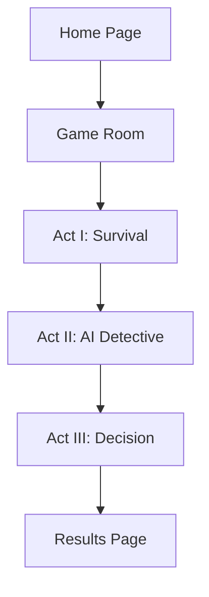

## 1. Product Overview
Redacted is a cyberpunk social deduction game where players navigate a dystopian city through information warfare rather than violence. Players join as either Mafia members or Citizens, managing digital resources while an AI detective learns from their actions to determine the city's fate.

The game teaches players about data bias, machine learning, and ethical decision-making through consequence-driven gameplay in a noir cyberpunk setting.

## 2. Core Features

### 2.1 User Roles
| Role | Registration Method | Core Permissions |
|------|---------------------|------------------|
| Player | Email registration | Join games, perform actions, view game state |
| Game Host | In-game promotion | Create games, manage game settings, start/end phases |

### 2.2 Feature Module
Our game requirements consist of the following main pages:
1. **Home page**: game lobby, active games list, create game option.
2. **Game room**: role assignment, action panel, resource display, player list.
3. **Results page**: game outcome, trust scores, karma rankings.

### 2.3 Page Details
| Page Name | Module Name | Feature description |
|-----------|-------------|---------------------|
| Home page | Game Lobby | Display available games with player count and status. Join existing games or create new ones. |
| Home page | Game Creation | Set game parameters (player count, phase timers). Generate unique game room code. |
| Game room | Role Assignment | Randomly assign players to Mafia or Citizen factions with specific roles. Show role description and abilities. |
| Game room | Action Panel | Perform faction-specific actions (hack, analyze, heal, gather intel). Consume resources (Battery, Capital). |
| Game room | Resource Display | Show current values for Karma, Battery, Cyberware, Capital, Cyberhealth. Update in real-time. |
| Game room | Player List | Display all players with their public information. Show trust indicators from AI detective. |
| Game room | AI Detective Panel | Display AI's current trust scores and analysis. Show recent AI observations and conclusions. |
| Game room | Phase Timer | Countdown timer for current game phase. Automatic phase transitions. |
| Results page | Victory Screen | Show game outcome (City Survives/Falls). Display top 3 players by trust and karma. |
| Results page | Player Statistics | Individual performance metrics including trust score, karma changes, and role effectiveness. |

## 3. Core Process
**Player Flow:**
1. Player joins homepage and sees available games
2. Creates or joins a game room
3. Waits for other players to join (minimum 6 players)
4. Receives random role assignment (Mafia or Citizen)
5. **Act I**: Performs actions to gather resources and information
6. **Act II**: Interacts with AI detective through actions and communications
7. **Act III**: Final confrontation based on AI's learned trust patterns
8. Views results and personal statistics

**Game Flow:**

## 4. User Interface Design

### 4.1 Design Style
- **Primary Colors**: Deep blue (#1a1a2e), Neon cyan (#00d4ff), Dark gray (#16213e)
- **Secondary Colors**: Rainy gray (#4a5568), Warning red (#e53e3e), Success green (#38a169)
- **Button Style**: Flat design with neon glow effects on hover
- **Font**: Monospace for data displays, Sans-serif for general text
- **Layout**: Dark card-based design with rain animation overlay
- **Icons**: Minimalist cyberpunk symbols, circuit board patterns

### 4.2 Page Design Overview
| Page Name | Module Name | UI Elements |
|-----------|-------------|-------------|
| Home page | Game Lobby | Dark cards with neon borders showing game status. Animated rain background. Cyan accent buttons. |
| Game room | Action Panel | Grid layout with ability cards. Resource cost indicators. Cooldown timers. |
| Game room | Resource Display | Horizontal status bar with progress indicators. Real-time value updates with smooth transitions. |
| Game room | AI Detective Panel | Terminal-style display with typing animation for AI messages. Trust meter visualization. |
| Results page | Victory Screen | Dramatic reveal animation. Top players highlighted with special effects. |

### 4.3 Responsiveness
Desktop-first design with mobile adaptation. Touch interactions optimized for mobile devices. Responsive grid layouts that collapse appropriately on smaller screens.

### 4.4 3D Scene Guidance
The game features subtle 3D elements for the cyberpunk atmosphere:
- **Environment**: Rainy cityscape with neon reflections
- **Lighting**: Harsh neon lights with deep shadows
- **Camera**: Fixed perspective with occasional parallax effects
- **Composition**: Layered depth with foreground rain, midground UI, background city
- **Animations**: Smooth hover effects, particle systems for rain, glitch effects for data corruption