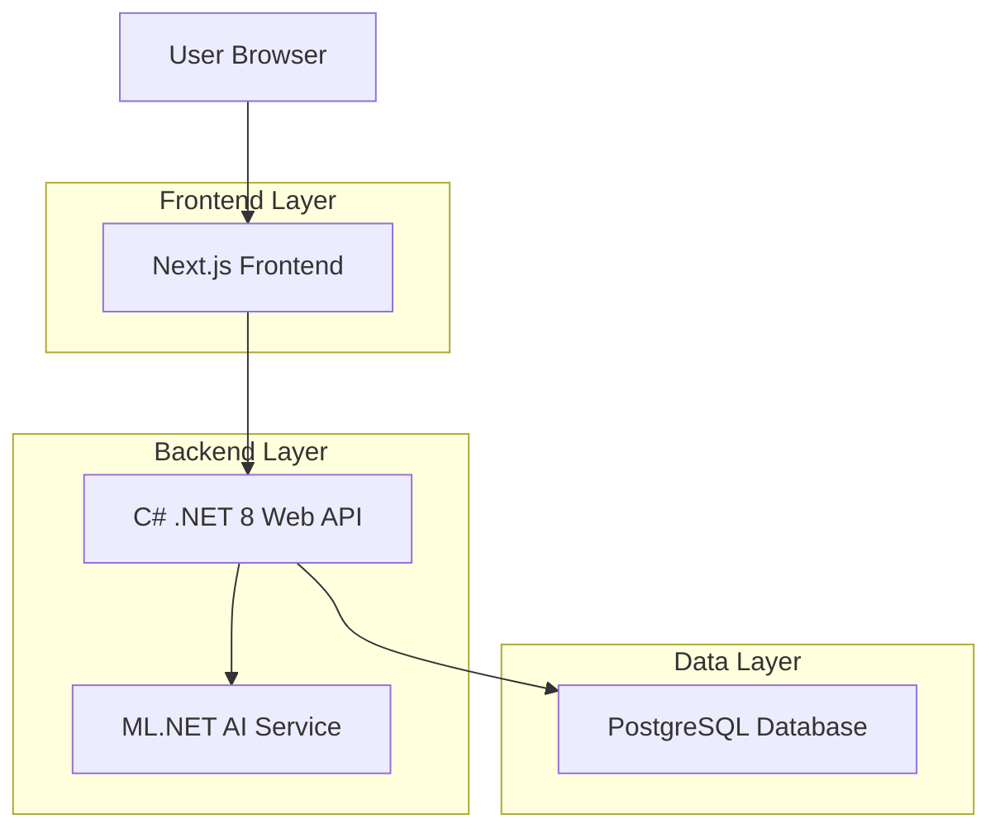
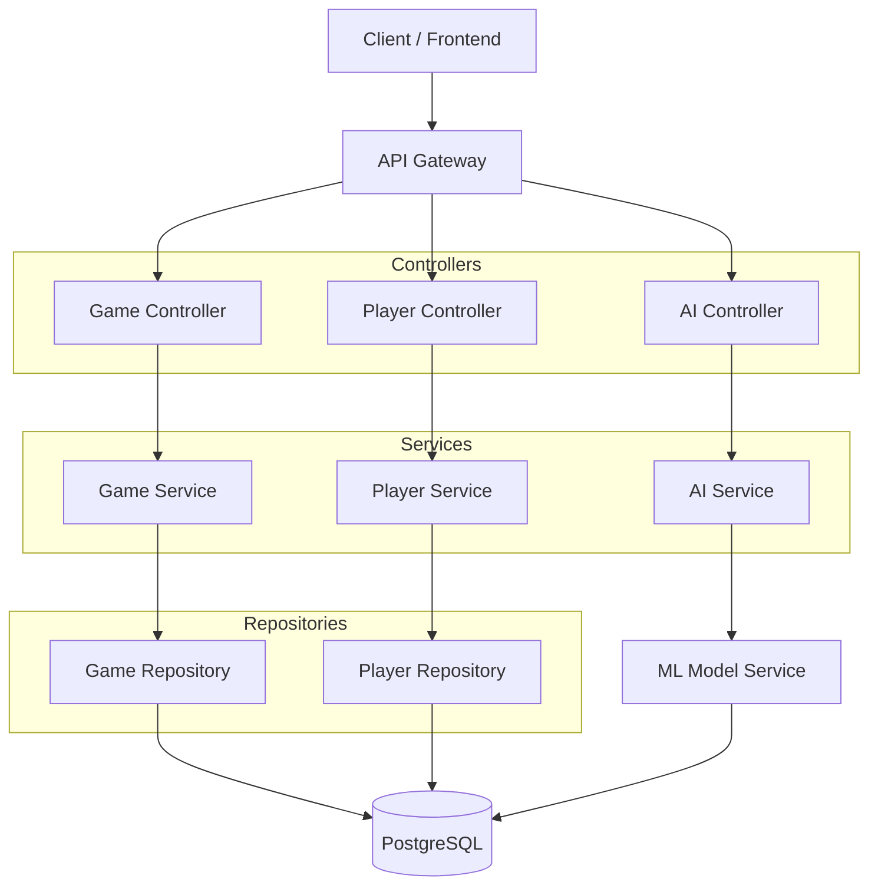
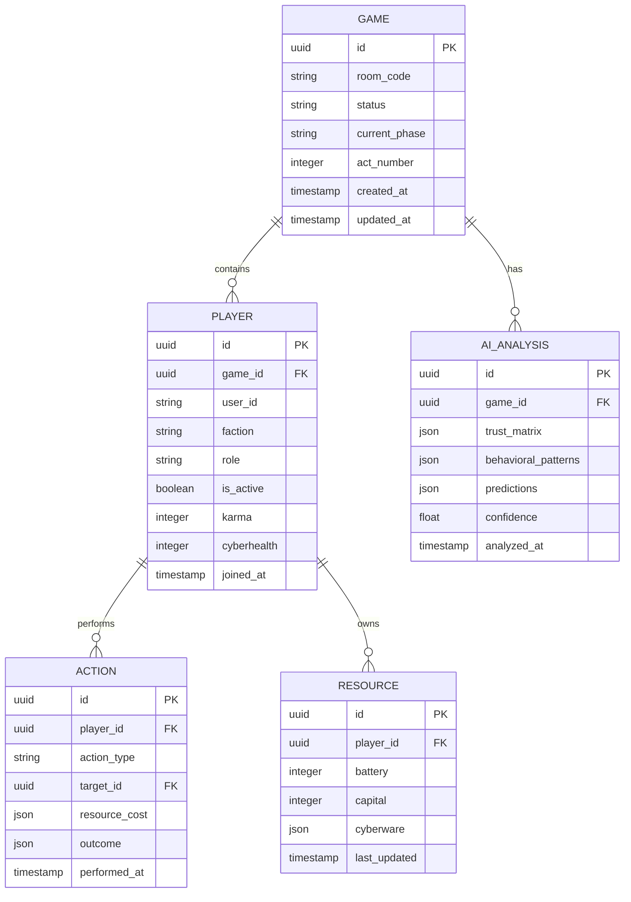

## 1. Architecture Design



## 2. Technology Description

- **Frontend**: Next.js@14 + TypeScript + TailwindCSS
- **Backend**: C# .NET 8 Web API
- **Database**: PostgreSQL 15
- **AI/ML**: ML.NET for supervised learning
- **Real-time**: SignalR for WebSocket connections
- **Initialization Tool**: create-next-app

## 3. Route Definitions

| Route | Purpose |
|-------|---------|
| / | Home page with game lobby |
| /game/[roomId] | Main game room interface |
| /results/[gameId] | Game results and statistics |
| /api/auth/* | Authentication endpoints |
| /api/game/* | Game management endpoints |
| /api/player/* | Player action endpoints |
| /api/ai/* | AI analysis endpoints |

## 4. API Definitions

### 4.1 Game Management APIs

**Create Game**
```
POST /api/game/create
```

Request:
| Param Name | Param Type | isRequired | Description |
|------------|------------|------------|-------------|
| playerCount | integer | true | Maximum players (6-12) |
| phaseDuration | integer | true | Duration in minutes per phase |
| hostId | string | true | Player ID of game host |

Response:
| Param Name | Param Type | Description |
|------------|------------|-------------|
| gameId | string | Unique game identifier |
| roomCode | string | 6-digit room code |
| status | string | Game status |

**Join Game**
```
POST /api/game/join
```

Request:
| Param Name | Param Type | isRequired | Description |
|------------|------------|------------|-------------|
| roomCode | string | true | 6-digit room code |
| playerId | string | true | Player identifier |

### 4.2 Player Action APIs

**Perform Action**
```
POST /api/player/action
```

Request:
| Param Name | Param Type | isRequired | Description |
|------------|------------|------------|-------------|
| gameId | string | true | Game identifier |
| playerId | string | true | Player identifier |
| actionType | string | true | Action type (hack/analyze/heal/intel) |
| targetId | string | false | Target player ID |
| resourceCost | object | true | Resources consumed |

**Get Game State**
```
GET /api/game/state/{gameId}
```

Response:
| Param Name | Param Type | Description |
|------------|------------|-------------|
| phase | string | Current game phase |
| players | array | Player states and roles |
| resources | object | Global resource pool |
| aiTrustScores | object | AI trust analysis |

### 4.3 AI Analysis APIs

**Get AI Analysis**
```
GET /api/ai/analysis/{gameId}
```

Response:
| Param Name | Param Type | Description |
|------------|------------|-------------|
| trustMatrix | object | Trust scores between players |
| behavioralPatterns | array | Detected player patterns |
| predictions | object | AI predictions for game outcome |
| confidence | number | AI confidence level |

## 5. Server Architecture Diagram



## 6. Data Model

### 6.1 Data Model Definition



### 6.2 Data Definition Language

**Games Table**
```sql
CREATE TABLE games (
    id UUID PRIMARY KEY DEFAULT gen_random_uuid(),
    room_code VARCHAR(6) UNIQUE NOT NULL,
    status VARCHAR(20) DEFAULT 'waiting' CHECK (status IN ('waiting', 'act1', 'act2', 'act3', 'finished')),
    current_phase VARCHAR(20) DEFAULT 'setup',
    act_number INTEGER DEFAULT 1 CHECK (act_number BETWEEN 1 AND 3),
    host_id UUID NOT NULL,
    max_players INTEGER DEFAULT 8 CHECK (max_players BETWEEN 6 AND 12),
    phase_duration_minutes INTEGER DEFAULT 10,
    created_at TIMESTAMP WITH TIME ZONE DEFAULT NOW(),
    updated_at TIMESTAMP WITH TIME ZONE DEFAULT NOW()
);

CREATE INDEX idx_games_room_code ON games(room_code);
CREATE INDEX idx_games_status ON games(status);
```

**Players Table**
```sql
CREATE TABLE players (
    id UUID PRIMARY KEY DEFAULT gen_random_uuid(),
    game_id UUID NOT NULL REFERENCES games(id) ON DELETE CASCADE,
    user_id VARCHAR(255) NOT NULL,
    faction VARCHAR(20) NOT NULL CHECK (faction IN ('mafia1', 'mafia2', 'mafia3', 'citizen')),
    role VARCHAR(30) NOT NULL CHECK (role IN ('hacker', 'analyst', 'doctor', 'intel', 'banker', 'farmer', 'cybersmith', 'whitehat', 'unemployed')),
    is_active BOOLEAN DEFAULT true,
    karma INTEGER DEFAULT 0,
    cyberhealth INTEGER DEFAULT 100 CHECK (cyberhealth BETWEEN 0 AND 100),
    joined_at TIMESTAMP WITH TIME ZONE DEFAULT NOW(),
    last_action_at TIMESTAMP WITH TIME ZONE DEFAULT NOW()
);

CREATE INDEX idx_players_game_id ON players(game_id);
CREATE INDEX idx_players_user_id ON players(user_id);
```

**Actions Table**
```sql
CREATE TABLE actions (
    id UUID PRIMARY KEY DEFAULT gen_random_uuid(),
    game_id UUID NOT NULL REFERENCES games(id) ON DELETE CASCADE,
    player_id UUID NOT NULL REFERENCES players(id) ON DELETE CASCADE,
    action_type VARCHAR(30) NOT NULL CHECK (action_type IN ('hack', 'analyze', 'heal', 'intel', 'protect', 'sabotage')),
    target_id UUID REFERENCES players(id) ON DELETE CASCADE,
    resource_cost JSONB NOT NULL DEFAULT '{}',
    outcome JSONB DEFAULT '{}',
    success BOOLEAN DEFAULT true,
    performed_at TIMESTAMP WITH TIME ZONE DEFAULT NOW()
);

CREATE INDEX idx_actions_game_id ON actions(game_id);
CREATE INDEX idx_actions_player_id ON actions(player_id);
CREATE INDEX idx_actions_performed_at ON actions(performed_at);
```

**Resources Table**
```sql
CREATE TABLE resources (
    id UUID PRIMARY KEY DEFAULT gen_random_uuid(),
    player_id UUID NOT NULL REFERENCES players(id) ON DELETE CASCADE,
    battery INTEGER DEFAULT 100 CHECK (battery >= 0),
    capital INTEGER DEFAULT 50 CHECK (capital >= 0),
    cyberware JSONB DEFAULT '[]',
    last_updated TIMESTAMP WITH TIME ZONE DEFAULT NOW()
);

CREATE INDEX idx_resources_player_id ON resources(player_id);
```

**AI Analysis Table**
```sql
CREATE TABLE ai_analysis (
    id UUID PRIMARY KEY DEFAULT gen_random_uuid(),
    game_id UUID NOT NULL REFERENCES games(id) ON DELETE CASCADE,
    trust_matrix JSONB NOT NULL DEFAULT '{}',
    behavioral_patterns JSONB DEFAULT '[]',
    predictions JSONB DEFAULT '{}',
    confidence FLOAT DEFAULT 0.0 CHECK (confidence BETWEEN 0 AND 1),
    training_data_size INTEGER DEFAULT 0,
    analyzed_at TIMESTAMP WITH TIME ZONE DEFAULT NOW()
);

CREATE INDEX idx_ai_analysis_game_id ON ai_analysis(game_id);
CREATE INDEX idx_ai_analysis_analyzed_at ON ai_analysis(analyzed_at);
```