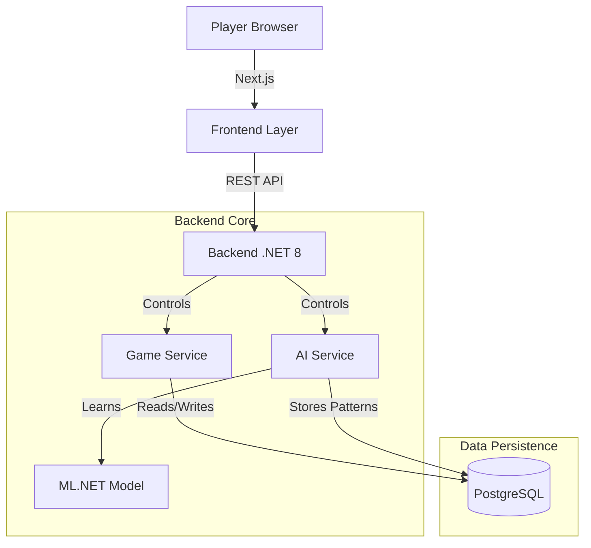

# Redacted Project: Technical Architecture

## 1. The Stack: A Layered Approach

We are using a robust, enterprise-grade stack adapted for rapid game development. This "Learning by Doing" approach allows us to explore industry-standard tools in a creative context.

### Layer 1: The Presentation (Frontend)
**Technology:** Next.js 14 (App Router), TypeScript, TailwindCSS
**New Approach:**
*   **Server Components:** We utilize Next.js Server Components to reduce client-side bundle size, shifting heavy logic to the server where possible.
*   **Atomic Design:** Components are broken down into atoms (Buttons), molecules (ActionPanel), and organisms (GameRoom) for maximum reusability.
*   **Strict Typing:** TypeScript is strictly enforced to prevent runtime errors, serving as a learning tool for discipline in coding.

### Layer 2: The Logic (Backend)
**Technology:** .NET 8 Web API (C#)
**New Approach:**
*   **Dependency Injection (DI):** Heavy use of DI for services (GameService, PlayerService) makes the code testable and modular.
*   **Controller-Service-Repository Pattern:** We separate concerns strictly. Controllers handle HTTP, Services handle Business Logic, and Repositories (via EF Core) handle Data. This teaches architectural cleanliness.
*   **Async/Await:** All I/O operations are asynchronous to handle multiple concurrent game rooms efficiently.

### Layer 3: The Intelligence (AI)
**Technology:** ML.NET
**New Approach:**
*   **In-Process Learning:** Unlike calling an external Python API, we run ML models directly within the .NET process. This reduces latency and complexity.
*   **Dynamic Training:** The model learns from *current* game data, introducing the concept of "Online Learning" or frequent retraining based on session data.

### Layer 4: The Persistence (Data)
**Technology:** PostgreSQL
**New Approach:**
*   **Relational Integrity:** We use a strictly normalized schema to ensure data consistency, crucial for a game where "truth" is the mechanic.
*   **JSONB Columns:** We utilize PostgreSQL's JSONB capabilities for flexible data storage (e.g., `resource_cost`, `trust_matrix`), blending SQL structure with NoSQL flexibility.

## 2. Architecture Diagram

